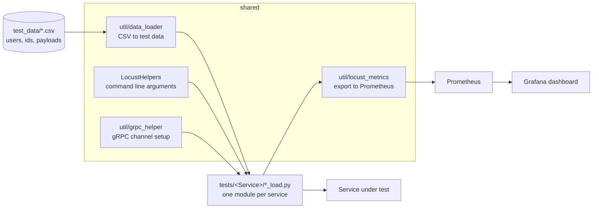

# locust-perf-suite


A structured load-testing suite built on Locust, for HTTP and gRPC services,
with Prometheus and Grafana wired up so a run produces a dashboard rather than
a terminal summary that scrolls away.

Load tests usually rot because each one is a standalone script with its own
copy of auth, its own CSV reading and its own idea of what a failure is. This
splits those apart: shared helpers, per-service scenarios, and one metrics
pipeline they all report through.

## How a run is wired



## Project structure

```
locust-perf-suite/
├── LocustHelpers/          # Locust command-line argument helpers
│   └── command_line_parser.py
├── util/                   # Shared utilities
│   ├── data_loader.py      # CSV test data
│   ├── locust_metrics.py   # Prometheus export
│   └── setup_monitoring.sh # brings up Prometheus + Grafana
├── proto_generated/        # Generated protobuf modules for gRPC scenarios
├── tests/                  # One directory per service under test
│   ├── DemoOrders/         # start here: runs against the bundled demo stack
│   ├── SampleService/      # HTTP and gRPC worked examples
│   ├── AuthService/
│   └── Payments/
├── config/                 # prometheus.yml and Grafana dashboards
├── docker-compose.monitoring.yml
├── requirements.txt
├── .env.example
└── README.md
```

`tests/SampleService/` is the one to read first: it is the smallest complete
example of both an HTTP and a gRPC scenario.

## Setup

### 1. Create Virtual Environment

```bash
python3 -m venv venv
source venv/bin/activate  # On Windows: venv\Scripts\activate
```

### 2. Install Dependencies

```bash
pip install -r requirements.txt
```

### 3. Configure Environment

```bash
cp .env.example .env
# Edit .env with your configuration
```

### 4. Bring up a target

Load tests need a service you own. Pointing this at a public API is abuse, and a
rate limiter makes the numbers meaningless anyway -- you end up measuring
somebody else's throttle rather than your service.

The `DemoOrders` suite targets the stack shipped with
[pytest-api-harness](https://github.com/sonukhobragade/pytest-api-harness): a
FastAPI order service with Postgres behind it and Redis in front.

```bash
docker compose -f ../pytest-api-harness/demo/docker-compose.yml up -d

locust -f tests/DemoOrders/orders_load.py --host http://localhost:8000 \
       --headless -u 20 -r 10 -t 20s
```

A 20-user run finishes in twenty seconds and shows the shape worth looking for:

```
GET /catalog/[sku]     p50 3ms    p98 54ms
GET /orders/[id]       p50 4ms    p99 43ms
```

That spread is the cache. The fast mode is a Redis hit; the slow mode is the
Postgres read behind a miss. A flat, slow distribution means the cache is not
being populated, which is a finding you cannot get from an average.

Raising the weight of `PATCH /orders/[id]/status` evicts more entries and should
visibly move read latency. That coupling between write rate and read latency is
the interesting result -- more so than peak RPS, which mostly measures your
laptop.

## Running Tests

### HTTP Load Test

```bash
# Basic run
locust -f tests/SampleService/sample_http_load.py --host http://localhost:8080

# With specific parameters
locust -f tests/SampleService/sample_http_load.py \
    --host http://localhost:8080 \
    --users 100 \
    --spawn-rate 10 \
    --run-time 5m \
    --check-p99-response-time 1000 \
    --check-p95-response-time 500 \
    --max-fail-ratio 0.01

# Headless mode with CSV output
locust -f tests/SampleService/sample_http_load.py \
    --host http://localhost:8080 \
    --users 100 \
    --spawn-rate 10 \
    --run-time 5m \
    --headless \
    --csv reports/test_results \
    --html reports/test_results.html
```

### gRPC Load Test

```bash
locust -f tests/SampleService/sample_grpc_load.py \
    --host grpc://localhost:50051 \
    --users 50 \
    --spawn-rate 5 \
    --run-time 3m
```

## Custom Command Line Arguments

The framework includes custom command line arguments for SLA validation:

- `--check-p99-response-time`: P99 response time threshold in ms (default: 1000)
- `--check-p95-response-time`: P95 response time threshold in ms (default: 500)
- `--max-fail-ratio`: Maximum allowed failure ratio (default: 0.01 = 1%)
- `--custom-config`: Custom configuration JSON string

## Writing New Tests

### HTTP Test Example

```python
from locust import HttpUser, TaskSet, task, between

class MyTasks(TaskSet):
    def on_start(self):
        # Initialize on user start
        pass

    @task(3)  # Weight of 3
    def my_task(self):
        self.client.get("/api/endpoint")

    @task(1)  # Weight of 1
    def another_task(self):
        self.client.post("/api/other", json={"key": "value"})

class MyUser(HttpUser):
    tasks = [MyTasks]
    wait_time = between(1, 3)
    host = "http://localhost:8080"
```

### gRPC Test Example

See `tests/SampleService/sample_grpc_load.py` for a template. It is not
runnable as shipped: gRPC needs stubs generated from your own .proto files, so
the file refuses to start until you have wired the tasks to real calls.

Key steps:
1. Generate protobuf files using `grpcio-tools`
2. Import generated stubs and messages
3. Use `GrpcClient` helper from `util/grpc_helper.py`
4. Implement tasks using the helper's `make_request` method

## Generating Protobuf Files

```bash
python -m grpc_tools.protoc \
    -I./proto \
    --python_out=./proto_generated \
    --grpc_python_out=./proto_generated \
    ./proto/your_service.proto
```

## Test Data Management

Place test data files in the `data/` directory:

```python
from util.data_loader import load_user_ids_from_csv

user_ids = load_user_ids_from_csv('data/users.csv', user_id_column=0)
```

## Best Practices

1. **Use Descriptive Task Names**: Name your tasks clearly for better reporting
2. **Implement on_start/on_stop**: Initialize resources in `on_start`, cleanup in `on_stop`
3. **Use catch_response**: Handle responses explicitly for better error tracking
4. **Set Appropriate Weights**: Use task weights to simulate realistic user behavior
5. **Configure Wait Times**: Use `between()` to simulate realistic user think time
6. **Validate SLAs**: Use custom command line arguments for automated SLA validation
7. **Generate Reports**: Always generate CSV and HTML reports for analysis

## CI/CD Integration

Example for running in CI/CD:

```bash
#!/bin/bash
set -e

# Run load test
locust -f tests/SampleService/sample_http_load.py \
    --host $TARGET_HOST \
    --users 100 \
    --spawn-rate 10 \
    --run-time 5m \
    --headless \
    --check-p99-response-time 1000 \
    --max-fail-ratio 0.01 \
    --csv reports/results \
    --html reports/results.html

# Exit code will be 3 if SLA checks fail
EXIT_CODE=$?
if [ $EXIT_CODE -eq 3 ]; then
    echo "Load test failed SLA checks"
    exit 1
fi
```

## Monitoring and Reporting

Reports are generated in the `reports/` directory:
- `reports/*.html` - HTML report with charts
- `reports/*_stats.csv` - Request statistics
- `reports/*_stats_history.csv` - Statistics over time
- `reports/*_failures.csv` - Failure logs

## Troubleshooting

### Issue: Module not found errors
- Ensure virtual environment is activated
- Run `pip install -r requirements.txt`

### Issue: gRPC connection errors
- Verify host and port are correct
- Check if server is running
- Ensure firewall allows connections

### Issue: Permission errors on data files
- Check file permissions
- Ensure files exist in `data/` directory

## Contributing

When adding new tests:
1. Create a new directory under `tests/`
2. Follow the naming convention: `*_load.py`
3. Include documentation in docstrings
4. Add example data files to `data/` if needed

## What it does not do

- **It generates load, it does not judge it.** There are no built-in SLA
  thresholds, so a run tells you what happened rather than whether it passed.
  Wire the Prometheus metrics to your own alerting for that.
- **The scenarios are examples, not your API.** `tests/` shows the shape of an
  HTTP and a gRPC scenario against generic endpoints. Meaningful numbers need
  scenarios written against your own service.
- **Test data is synthetic.** The CSVs under `test_data/` exist so a run
  starts; they are invented, and results from them say nothing about your
  production data distribution.
- **Single-node by default.** Locust distributed mode works, but nothing here
  configures a worker fleet, so one machine's network and CPU are your ceiling.
- **No warmup handling.** JIT and connection pools mean the first seconds of a
  run are not representative. Discard them yourself.

## License

MIT — see [LICENSE](LICENSE).
